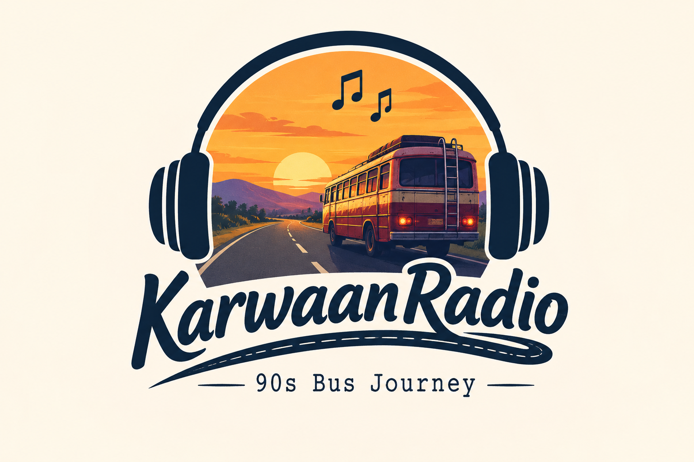

<div align="center">



# 🚌 Karwaan Radio

**A nostalgic 90s Indian hill-road bus journey — reimagined as a living, breathing music player.**

Rain on the window. A cassette clicking into place. The murmur of fellow passengers.
Karwaan Radio turns music playback into a cinematic road-trip experience.

[](https://www.karwaanradio.website/)


[**🌐 Live Demo**](https://www.karwaanradio.website/) · [Features](#-features) · [Tech Stack](#-tech-stack) · [Getting Started](#-getting-started) · [Project Structure](#-project-structure)

</div>

---

## ✨ Overview

**Karwaan Radio** simulates the feeling of a monsoon-evening bus ride through the Himalayan foothills. Pick a destination, a season, and a time of day, and the whole scene — sky, weather, ambient bus sounds, and a curated cassette-style playlist — shifts to match. It's part music player, part interactive diorama, part shared listening room.

Under the hood it pairs a richly animated React frontend with a FastAPI + WebSocket backend that powers a **live passenger counter** and a **real-time chat drawer**, so everyone tuned in shares the same bus.

## 🎬 Features

| | |
|---|---|
| 📼 **Cassette-style player** | Skeuomorphic cassette player UI with play/pause, shuffle, repeat, and scrubbing |
| 🏔️ **Dynamic scenery** | Parallax mountain scenes for Himachal Pradesh and Uttarakhand with time-of-day sky gradients |
| 🌦️ **Live weather FX** | Clear, rainy, and snowy overlays that shift ambience, temperature, and mood |
| 🪟 **Bus window overlay** | Glassmorphic "misty window" frame with grain/noise texture for a filmic, nostalgic feel |
| 🎧 **Curated playlists** | 8 categories — 90s Bollywood, 2000s Nostalgia, Rajasthani Folk, English, Punjabi, Haryanvi, Pahadi, and a rotating Hitlist |
| 👥 **Live passenger count** | Real-time WebSocket-powered counter showing how many people are riding along |
| 💬 **Live chat** | In-bus WebSocket chat drawer so fellow passengers can talk as the journey plays |
| 🎵 **Song suggestions** | Riders can suggest tracks; an admin modal lets maintainers review submissions |
| 🔊 **Layered ambient audio** | Independently mixed music, environment, and bus-engine volume channels |
| ⚙️ **Persisted settings** | Location, weather, time, category, and volume preferences saved to local storage |

## 🛠️ Tech Stack

**Frontend**
- [React 19](https://react.dev/) bootstrapped with [Create React App](https://create-react-app.dev/) via [CRACO](https://craco.js.org/)
- [Tailwind CSS](https://tailwindcss.com/) + [shadcn/ui](https://ui.shadcn.com/) (Radix UI primitives)
- [Framer Motion](https://www.framer.com/motion/) for scene and UI animation
- [React Router](https://reactrouter.com/), [TanStack Query](https://tanstack.com/query), [SWR](https://swr.vercel.app/)
- [Supabase JS](https://supabase.com/) client for auxiliary data
- Deployed on [Vercel](https://vercel.com/)

**Backend**
- [FastAPI](https://fastapi.tiangolo.com/) + [Uvicorn](https://www.uvicorn.org/)
- [MongoDB](https://www.mongodb.com/) via [Motor](https://motor.readthedocs.io/) (async driver)
- Native **WebSockets** for live passenger counts and chat
- [Pydantic v2](https://docs.pydantic.dev/) for data models, [PyJWT](https://pyjwt.readthedocs.io/) / [passlib](https://passlib.readthedocs.io/) for auth primitives
- [Boto3](https://boto3.amazonaws.com/) for audio asset storage on **Cloudflare R2**

**Tooling**
- `pytest` + `pytest-xdist` for parallel backend tests
- `black`, `isort`, `flake8`, `mypy` for backend linting/formatting
- `eslint` for frontend linting

## 📂 Project Structure

```
ViralRadio-main/
├── backend/                  # FastAPI application
│   ├── server.py             #   API routes + WebSocket managers (passengers, chat)
│   ├── requirements.txt
│   └── pytest.ini
├── frontend/                  # React (CRA + CRACO) application
│   ├── src/
│   │   ├── components/       #   CassettePlayer, MountainScene, WeatherFX, LiveChatDrawer, ...
│   │   ├── hooks/             #   useAmbientAudio, useLivePassengers, useLiveChat, ...
│   │   ├── lib/constants.js  #   Locations, weather, time-of-day, playlists, track data
│   │   └── constants/testIds #   Centralized data-testid registry for e2e testing
│   └── public/
├── old bangers/               # Source audio libraries (Nostalgic, Rajasthani)
├── add_songs.py               # Script to add/register new tracks
├── process_tracks.py          # Track metadata processing pipeline
├── upload_to_r2_custom.py     # Uploads processed audio to Cloudflare R2
├── update_constants.py        # Regenerates frontend/src/lib/constants.js
├── design_guidelines.json     # Source-of-truth visual/UX design spec
└── tests/                     # Backend test suite
```

## 🚀 Getting Started

### Prerequisites

- [Node.js](https://nodejs.org/) 18+ and [Yarn](https://yarnpkg.com/)
- [Python](https://www.python.org/) 3.10+
- A running [MongoDB](https://www.mongodb.com/) instance (local or hosted)

### 1. Clone the repo

```bash
git clone https://github.com/Whopie29/ViralRadio-main.git
cd ViralRadio-main
```

### 2. Backend setup

```bash
cd backend
python -m venv venv && source venv/bin/activate   # Windows: venv\Scripts\activate
pip install -r requirements.txt
```

Create a `.env` file inside `backend/`:

```env
MONGO_URL=mongodb://localhost:27017
DB_NAME=viral_radio
CORS_ORIGINS=http://localhost:3000
```

Run the API:

```bash
uvicorn server:app --reload --port 8000
```

The API will be available at `http://localhost:8000/api`, with WebSocket endpoints at `/api/ws/passengers` and `/api/ws/chat`.

### 3. Frontend setup

```bash
cd frontend
yarn install
```

Create a `.env` file inside `frontend/`:

```env
REACT_APP_BACKEND_PORT=8000
REACT_APP_SUPABASE_URL=your_supabase_project_url
REACT_APP_SUPABASE_ANON_KEY=your_supabase_anon_key
```

Run the dev server:

```bash
yarn start
```

Visit `http://localhost:3000` and hop on board. 🚌

### 4. Run backend tests

```bash
cd backend
pytest
```

## 🎼 Managing Music

The `old bangers/` directory holds source audio, processed via a small pipeline:

1. `process_tracks.py` — extracts metadata and normalizes track entries
2. `upload_to_r2_custom.py` — uploads processed audio files to a Cloudflare R2 bucket
3. `update_constants.py` — regenerates `frontend/src/lib/constants.js` with the latest catalog
4. `add_songs.py` — helper for registering individual new tracks

> ⚠️ **Note:** `upload_to_r2_custom.py` currently ships with hardcoded fallback R2 credentials. Move these into environment variables (and rotate the existing keys) before treating this repository as public-safe.

## 🗺️ Roadmap Ideas

- [ ] User accounts / saved playlists
- [ ] Additional regional soundscapes and locations
- [ ] Mobile app wrapper
- [ ] Moderation tools for live chat

## 🤝 Contributing

Contributions, issues, and feature requests are welcome!

1. Fork the project
2. Create your feature branch (`git checkout -b feature/amazing-feature`)
3. Commit your changes (`git commit -m 'Add some amazing feature'`)
4. Push to the branch (`git push origin feature/amazing-feature`)
5. Open a Pull Request

## 📄 License

No license has been specified for this repository yet. Consider adding one (e.g. [MIT](https://choosealicense.com/licenses/mit/)) so others know how they can use your code.

---

<div align="center">

Made with 🎧 for anyone who misses the back seat of a hill-road bus.

</div>
